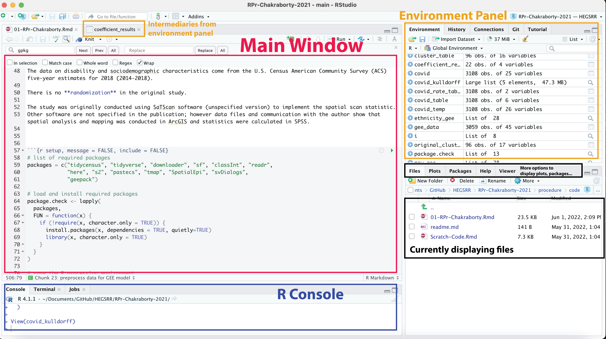
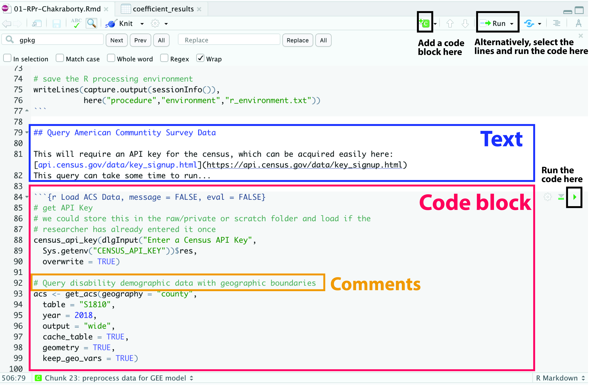

# Workshop Technical Guide

## Part 1: Managing Github Repositories

**1. Getting started:**
- Login to your account both on Github desktop and on the web browser.
- Go to the [HEGSRR](https://github.com/HEGSRR) website and see if you could find the three repositories named as: [RPr-Chakraborty-2021](https://github.com/HEGSRR/RPr-Chakraborty-2021), [UCGIS-Workshop](https://github.com/HEGSRR/UCGIS-Workshop), and [HEGSRR-Template](https://github.com/HEGSRR/HEGSRR-Template)

**2. Fork the three repositories to your personal Github account:**
- Go to the [HEGSRR-Template](https://github.com/HEGSRR/HEGSRR-Template) and click `Use this template`.
- You may change the `Repository name`, with the prefix of RPr for reproduction analysis and RE for replication analysis.
- Add a description to the repository if you like and set the repository to public.
- Go to the [RPr-Chakraborty-2021](https://github.com/HEGSRR/RPr-Chakraborty-2021) repository and find the `Fork` option on the top right corner. You may leave the repository name as it is.  
- Go to the [UCGIS-Workshop](https://github.com/HEGSRR/UCGIS-Workshop) and repeat the same process.

**3. Clone the three repositories to your local computer:**
- On your Github desktop, go to `File` -> `Clone Repository`, where you will see all of the repositories you have access to.
- Choose the RPr-Chakraborty-2021 repository and choose the file path on your local computer where you want to save it to and hit `Clone`.
- Repeat the same process for the other two repositories you just forked.

**4. Manipulating files on Github repositories:**
- Go to the file directory on your local computer where you saved the repositories and see if you could find three folders, one for each cloned repository.
- On your Github desktop app, switch the `Current Repository` to HEGSRR-Template and click `Open in Atom`.
- Open the file named `readme.md`, make some changes to the file, and save it.
- Go to `Packages` -> `Markdown Preview` -> `Toggle Preview` or `Toggle Github Style` to preview the file. Note that you might need to click `Toggle Break on Single New Line` before generating the previews.
- Go back to Github desktop, provide a summary for the changes you have made and click `Commit to main` and then `Push` the repository.
- Go back to your own Github account page on the web browser and see if you could find the most recent updates you just committed.
- On the web browser, find the same `readme.md` file and click on the little pencil icon to the right.
- Make any changes you like and commit the changes directly on the web browser.
- Go back to Github desktop, and click on `Fetch origin` and then `Pull`.

**5. More on file manipulation:**
- Open the HEGSRR-Template repository in Atom and go to `data/raw/public`.
- Right click on the public folder -> `New File`.
- Write a line in the file and save it.
- Repeat the same process, but create the file in `data/raw/private` folder.
- Commit and push the changes.
- Go to the Github page, where you should be able to see the file you created only in the public folder but not the private.
- Go back to the Github desktop, click on `History` tab right next to `Changes`.
- Right click on the last change -> `Revert Changes in Commit` and push the changes.

## Part 2: Understanding the Workflow of Research Papers

**1. Identify important informations:**
- Using Chakraborty's paper as an example, we have highlighted the *data sources* in blue
- *Methodology and data processing* steps in pink
- *Intermediary* (where we could check and compare results) as well as any **final results** in orange.

**2. Generate a workflow diagram:**
- Research for data sources as well as their metadata.
- Use different shapes and/or colors to differentiate between components, such as data sources and intermediary layers.
- Use arrows and labels to indicate step progression based on the methodology section of the paper.
- Alternatively, you may cut figures out from the paper, write the steps on note cards,  and arrange them accordingly.

## Part 3: Running the R Markdown

**1. Opening the R Markdown:**
- Go to the directory where you saved your Github repositories. Find the RPr-Chakraborty-2021 repository and open the `R-project`.
- In the lower left corner, go to `Files` -> `RPr-Chakraborty-2021` -> `procedure` -> `code` -> `01-RPr-Chakraborty.Rmd`.

**2. RStudio orientation:**
- The main window displays the R Markdown file
- The console allows you to write code directly in it and run.
- The environment panel displays all intermediaries created, which you could click on any of them to view.
- The lower right panel has a miscellaneous function of displaying files, plots, R packages installed, and allows you to search for any particular R function.

**3. Basic elements of R Markdown:**

## Resources
- Markdown style guide
- Data Carprentry Workshops: https://datacarpentry.org/lessons/
- Course website, R tutorial, cheatsheet
